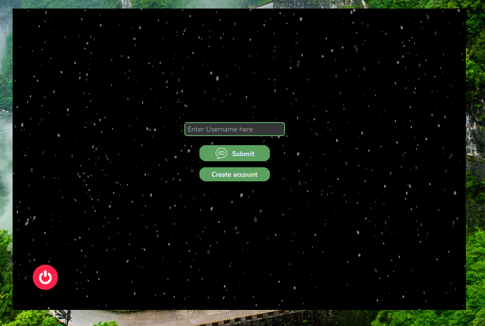
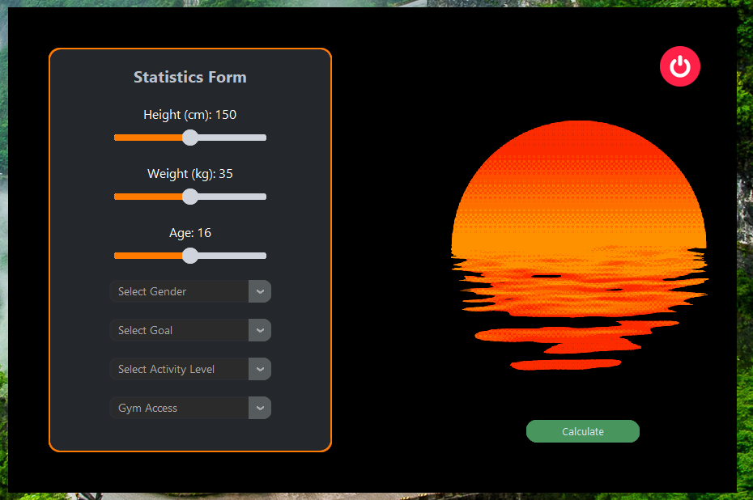

🏋️ MacroTrack

AI-powered Workout Planner — modern Python app with Google Gemini integration.

### Home Page

### Second Page

MacroTrack is a Python desktop application with a clean GUI (built using CustomTkinter) that helps users design and track personal workout programs.
It leverages the Google Gemini API to dynamically generate tailored training recommendations, making fitness planning smarter and more accessible.

✨ Features

🎨 Modern GUI → professional look & smooth user experience

🧠 AI-powered workouts → Gemini API generates unique training plans

⚡ Personalised goals → fat loss, muscle gain, or strength

💾 Save & load sessions → long-term progress tracking

📊 Basic analytics → sets, reps, and volume history

🔐 Secure key-based login → user profiles and API key stored locally

🛠️ Tech Stack

Python 3.10+

CustomTkinter — modern GUI framework

Google Gemini API — workout recommendation engine

python-dotenv — environment variable management

pandas — session data storage and CSV export

🚀 Quick Start

Unix/macOS

git clone gh repo clone Grape-716/Macro-Track 

Windows (PowerShell)

git clone https://github.com/Grape-716/Macro-Track.git

🎥 Demo
👉 Full demo video: https://your-website.com/macrotrack-demo

⚙️ How It Works

User logs in with username & Gemini API key

Chooses fitness goal & available training days

MacroTrack builds a prompt for Gemini and fetches a workout plan

Plan is parsed & displayed in the GUI

User can save sessions, track progress, and export results

🗺️ Roadmap

📈 Advanced analytics & charts

🍎 Nutrition & calorie/macro calculator

📤 Export workouts

🤝 Contributing

Pull requests are welcome! Open an issue to discuss major changes.

👤 Author

Umar Kousar — Aspiring Quant Developer

Portfolio: https://ikrprofile.netlify.app
 · GitHub: Grape-716
 · LinkedIn: linkedin.com (wait for it)
